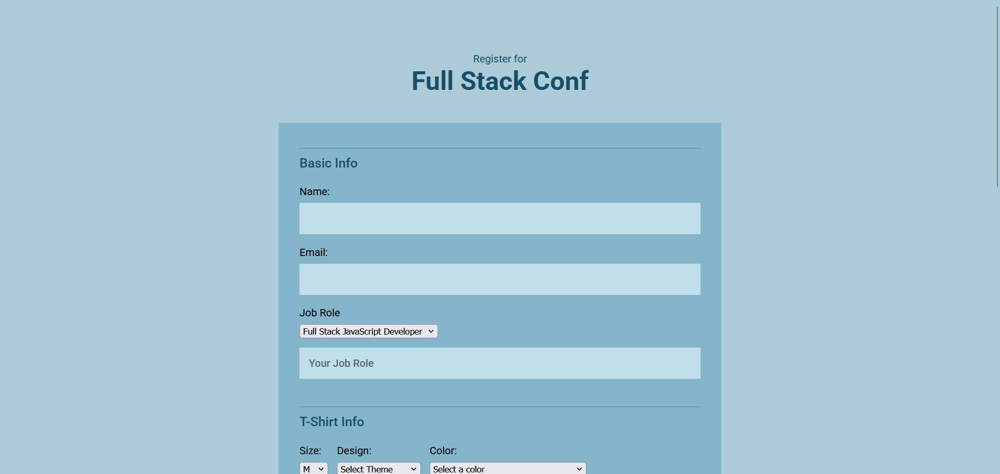

# TP Full Stack Conf

Projet fil rouge lié à la séquence sur le JavaScript et le DOM

## Consignes

- [X] Mettre le focus sur le premier champ de texte. Lorsque la page se charge, donner automatiquement le focus au premier champ de texte.

- [X] Afficher un champ de texte lorsque l'option "Autre" est sélectionnée dans le menu déroulant "Poste". Assurez-vous d'ajouter un champ de saisie de texte avec l'identifiant `other-title`. Ajoutez un texte indicatif "Votre poste" dans le champ.

- [X] Pour le menu des couleurs de T-shirts, n'affichez que les options correspondant au design sélectionné dans le menu "Design".

- [X] Si l'utilisateur sélectionne un atelier, empêchez la sélection d'un atelier ayant lieu à la même date et heure — désactivez la case à cocher correspondante et indiquez visuellement que l'atelier en conflit n'est pas disponible.

- [X] Lorsque l'utilisateur décoche une activité, assurez-vous que les activités en conflit (s'il y en a) ne soient plus désactivées.

- [X] À mesure que l'utilisateur sélectionne des activités pour s'inscrire, un total en temps réel doit s'afficher sous la liste des cases à cocher. Par exemple, si l'utilisateur sélectionne "Conférence principale", alors "Total : 200 $" doit apparaître. S'il ajoute un atelier, le total doit passer à "Total : 300 $".

- [X] L'option de paiement "Carte de crédit" doit être sélectionnée par défaut, affichant la section `#credit-card`, et masquant les informations pour "PayPal" et "Bitcoin".

- [X] Lorsque l'utilisateur sélectionne l'option de paiement "PayPal", affichez les informations pour PayPal et masquez les informations pour la carte de crédit et "Bitcoin".

- [X] Lorsque l'utilisateur sélectionne l'option de paiement "Bitcoin", affichez les informations pour Bitcoin et masquez les informations pour la carte de crédit.

- [X] Afficher des messages d'erreur et empêcher l'utilisateur de soumettre le formulaire si l'une des erreurs de validation suivantes existe :
  - Le champ "Nom" ne peut pas être vide.
  - Le champ "E-mail" doit contenir une adresse e-mail correctement formatée (vous n'avez pas besoin de vérifier qu'il s'agit d'une adresse réelle, mais elle doit être formatée comme ceci : dave@teamtreehouse.com, par exemple. Vous devrez utiliser une expression régulière pour répondre à cette exigence. Voir la liste des ressources pour des liens sur les expressions régulières).
  - Au moins une activité doit être cochée dans la liste sous "Inscription aux activités".
  - Une option de paiement doit être sélectionnée.
  - Si l'option "Carte de crédit" est sélectionnée, l'utilisateur doit fournir un numéro de carte de crédit, un code postal et un CVV (code de 3 chiffres).

- [X] Masquer le label "Couleur" et le menu déroulant jusqu'à ce qu'un design de T-shirt soit sélectionné dans le menu "Design".

- [X] Styliser les menus déroulants du formulaire pour qu'ils correspondent à l'apparence des champs de texte (voir la liste des ressources pour un article sur l'amélioration de l'apparence des menus déroulants avec CSS et JavaScript).

- [X] Valider que le numéro de carte de crédit est correctement formaté (voir la liste des ressources pour des informations sur comment le faire).
